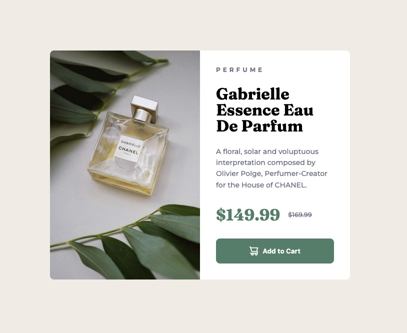

# Frontend Mentor - Product preview card component solution

This project is a personal implementation of the Front‑End Mentor HTML/CSS challenge.

I built a responsive layout, optimized images for different devices, and added subtle visual touches to enhance the user experience.

This is a solution to the [Product preview card component challenge on Frontend Mentor](https://www.frontendmentor.io/challenges/product-preview-card-component-GO7UmttRfa). Frontend Mentor challenges help you improve your coding skills by building realistic projects.

## Table of contents

- [Overview](#overview)
  - [The challenge](#the-challenge)
  - [Screenshot](#screenshot)
  - [Links](#links)
- [My process](#my-process)
  - [Built with](#built-with)
  - [What I learned](#what-i-learned)
  - [Useful resources](#useful-resources)
- [Author](#author)

## Overview

### The challenge

Users should be able to:

- View the optimal layout depending on their device's screen size
- See hover and focus states for interactive elements

### Screenshot



### Links

- Solution URL: [Solution](https://github.com/vince4dev/challenge5)
- Live Site URL: [Live site](https://vince4dev.github.io/challenge5/)

## My process

### Built with

- Semantic HTML5 markup
- HTML picture source
- CSS custom properties
- Flexbox
- CSS Grid
- Mobile-first workflow

### What I learned

1. **`<picture>` + srcset & media**

- I learned how to serve the right image for the right viewport by combining the `<picture>` element with srcset and media queries. This technique reduces bandwidth on mobile devices while keeping high‑resolution images for larger screens.

```html
<picture class="perfume__img">
  <source
    srcset="./assets/images/image-product-desktop.jpg"
    media="(width >= 600px)"
  />
  
</picture>
```

2. **overflow: hidden;**

- I discovered how to hide the overflow of an image or container, which is especially useful for creating card‑style designs where images need to stay within a fixed boundary.

```css
.perfume {
  ...
  overflow: hidden;
}
```

3. **text-decoration: line-through;**

- used the CSS property `text-decoration: line-through` to strikethrough the old price, thus improving the visual hierarchy.

```css
.perfume__old-price {
  ...
  text-decoration-line: line-through;
}
```

### Useful resources

- [google-webfonts-helper](https://gwfh.mranftl.com/fonts) - This helped me find the font and integrate it into the project.
- [MDN](https://developer.mozilla.org/fr/) - Resources for Developers.

## Author

- Frontend Mentor - [@vince4dev](https://www.frontendmentor.io/profile/vince4dev)
